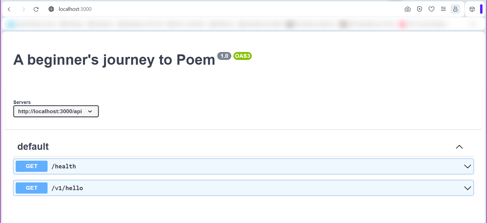

# 01_healthcheck

This is the entrypoint to our journey. It is the absolute bare minimum we need to to build an asynchronous, OpenAPIv3-compatible REST API using [poem-openapi](https://github.com/poem-web/poem/tree/master/poem-openapi) and [tokio](https://tokio.rs).

## build and run the application

```
# build and run the application
cargo run
```

## usage: command line

```
# check the API's health
curl http://localhost:3000/api/health

# query the API
curl http://localhost:3000/api/v1/hello
curl http://localhost:3000/api/v1/hello?name=world
```

## usage: browser

http://localhost:3000

